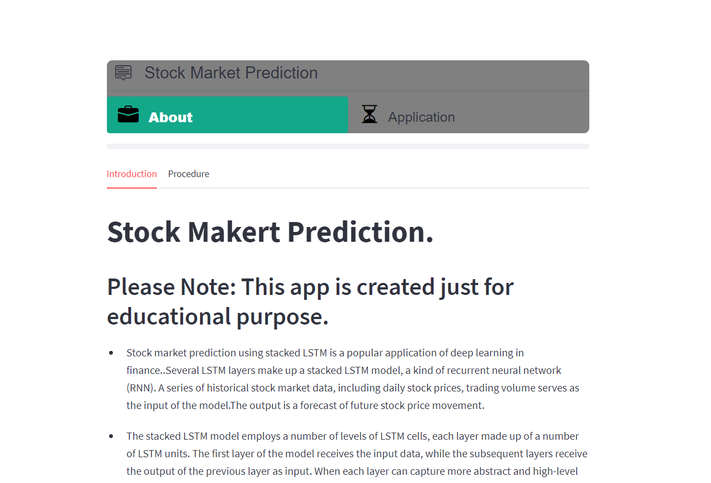
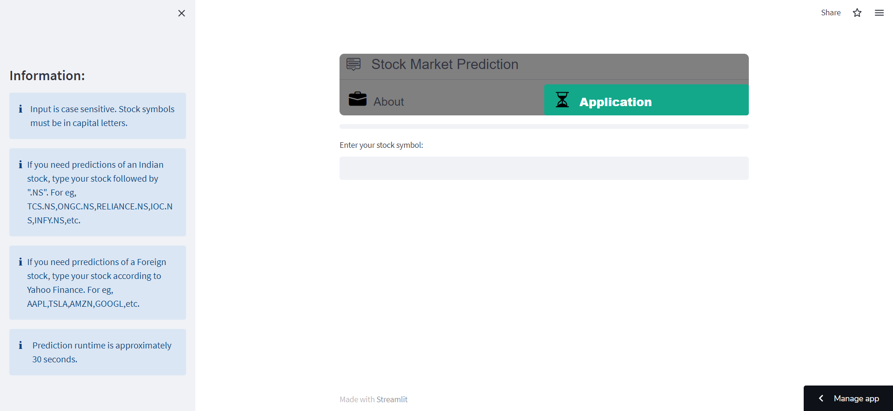
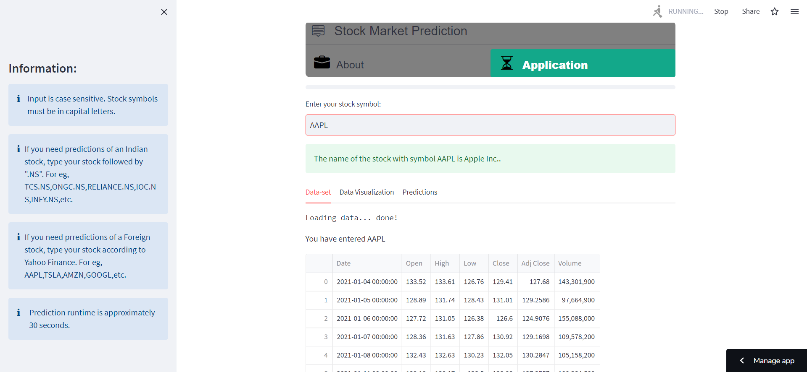
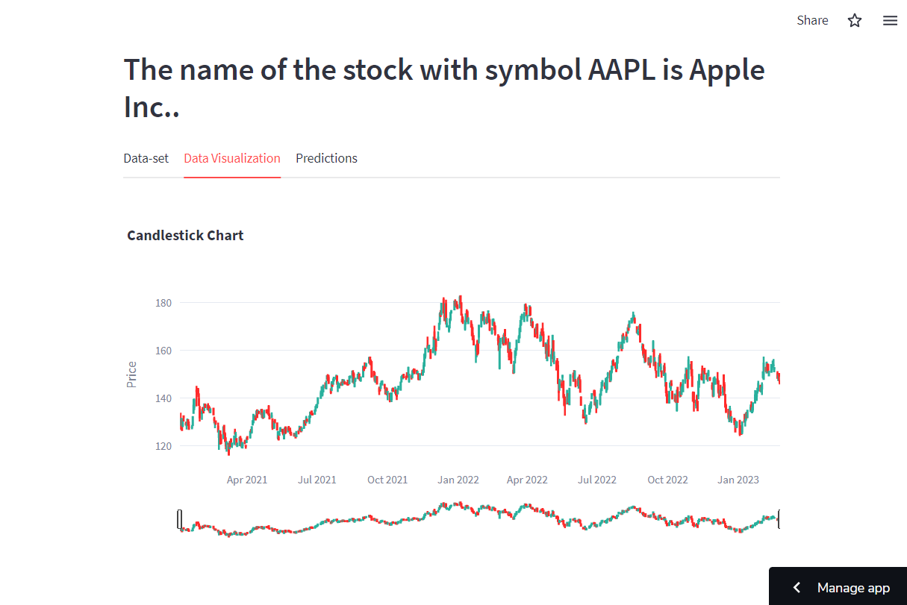
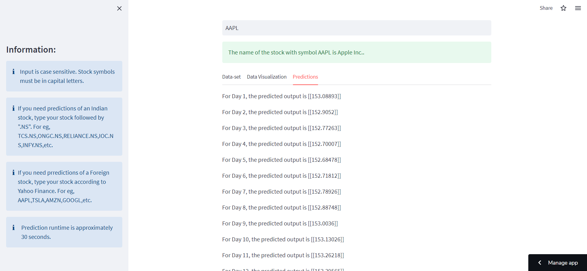

# Stock Market Prediction and Streamlit Deployement
Config files for my GitHub profile.
## View this in action

Using [streamlit](https://streamlit.io) to show the [Stock market prediction](https://c19sitdash.azurewebsites.net/) based on real time experience [](https://muthu2312-stock-deployment-stock-prediction-pfk9og.streamlit.app/)








## Code execution

Ensure all dependencies are installed

```console
pip install -r requirements.txt
```

Run this command

```console
streamlit run path/to/stock1.py
```

To update requirements.txt, navigate to folder containing stock1.py and execute the following

```console
yfinance==0.2.12(use latest update) 
```
